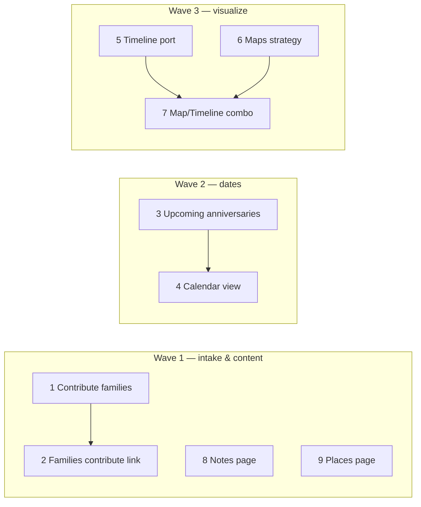

# Public site backlog — implementation plan

**Date:** 2026-05-16  
**Status:** Planning  
**App:** `the-gonsalves-family` (https://temp.gonsalvesfamily.com)

This document tracks nine planned features for the public family archive. Nav links for several items already exist in `site-nav/navConfig.ts`; most routes are placeholders or missing pages.

---

## Summary

| # | Feature | Nav / route (target) | Depends on |
|---|---------|------------------------|------------|
| 1 | Contribute: attach **families** | `/contribute` | — |
| 2 | Families page → Contribute link | `/families`, `/families/[id]` | **1** |
| 3 | **Upcoming Anniversaries** page | `/more/upcoming-anniversaries` (rename from `todays-anniversaries`) | — |
| 4 | **Calendar** view | `/visualize/calendar` | **3** (shared date logic, optional) |
| 5 | **Timeline Generator** (public) | `/timelines` | Admin port |
| 6 | **Maps** — strategy & build | `/maps` | Discovery |
| 7 | **Map / Timeline combo** | `/visualize/timeline-map` | **5**, **6** |
| 8 | **Notes** page | `/archive/notes` | — |
| 9 | **Places** page | TBD (`/places` vs `/tree/places`) | — |

---

## Principles

- **API thin shell:** tree/query logic belongs in shared packages (`gedcom-go` / Prisma loaders), not duplicated in route handlers when avoidable.
- **Reuse admin patterns:** Timeline Creator (`the-gonsalves-family-admin`) is the reference for public Timelines.
- **Reuse homepage widgets:** `UpcomingDates` and `GET /api/tree/events/upcoming` already implement a 3‑month BIRT/DEAT/MARR window — extend, don’t rewrite blindly.
- **Full place labels:** use `fullPlaceLabelFromGedcomPlace()` / linked `GedcomPlace` rows per workspace rules.
- **Match existing shells:** `ResearchPageShell`, profile pages, and `AlbumViewRouteShell` (Navbar + main + `Footer`).

---

## 1. Contribute — attach families (like people)

### Goal

Let contributors tag one or more **families** on a submission, the same way they can tag multiple **individuals** today.

### Current state

| Area | Location |
|------|----------|
| UI | `src/components/contribute/ContributeView.tsx` — multi-person picker, `individualXrefs` on submit |
| Route prefill | `src/app/contribute/page.tsx` — `?individualXref=&individualName=` |
| API | `src/app/api/public-intake/contributions/route.ts` |
| DB | `Contribution` has single `relatedFamilyXref`; `ContributionIndividual` junction for people |

Individuals: many via `ContributionIndividual` + `individualXrefs[]`. Families: only optional scalar `relatedFamilyXref` (legacy / single).

### Recommended approach

1. **Schema:** add `ContributionFamily` junction (mirror `ContributionIndividual`): `contributionId`, `familyId`, `fileUuid`, `familyXref`, label snapshot, `sortOrder`.
2. **API:** accept `familyXrefs[]` (multipart + JSON); `resolveContributionFamilies()` analogous to `resolveContributionIndividuals()`; keep `relatedFamilyXref` as first family for backward compatibility.
3. **UI:** family search picker (reuse public family search API or add thin `/api/tree/families` picker endpoint); chips + remove; optional `?familyXref=&familyLabel=` prefill on `/contribute`.
4. **Admin review:** ensure admin contribution detail shows linked families (admin app follow-up if missing).

### Acceptance criteria

- [ ] User can add/remove multiple families before submit.
- [ ] Submission persists all families in junction table.
- [ ] Deep link from family profile pre-selects that family (see **2**).

---

## 2. Families page — link to Contribute

### Goal

After **1**, family list and family profile pages offer a **Contribute** action like individual profiles.

### Current state

- `IndividualProfilePage` builds `contributionHref` → `/contribute?individualXref=…&individualName=…`
- `FamilyProfilePage` — no contribute link yet.

### Tasks

1. Add `contributionHref(family)` helper (xref + display label).
2. Desktop + mobile family profile: CTA button/link.
3. Optional: row action on `FamiliesPage` cards.

### Acceptance criteria

- [ ] From a family profile, one click opens Contribute with that family pre-attached.

---

## 3. Upcoming Anniversaries page

### Goal

Dedicated **More → Upcoming Anniversaries** page:

- **Horizon:** next **3 months** only (same window as homepage).
- **Grouping:** primary = **calendar month**; secondary = **event type**:
  - Birthdays (`BIRT`)
  - Death anniversaries (`DEAT`)
  - Marriage anniversaries (`MARR`) — include only when date is suitable (see open questions).

### Current state

| Piece | Location |
|-------|----------|
| API | `GET /api/tree/events/upcoming` — BIRT/DEAT/MARR, month/day window with year wrap |
| Types | `src/types/tree.ts` — `UpcomingEvent` |
| Homepage UI | `src/components/homepage/UpcomingDates/UpcomingDates.tsx` — tabs by type, flat list |
| Nav | `href: "/more/todays-anniversaries"` — **rename** to `/more/upcoming-anniversaries` (label already “Upcoming Anniversaries”) |

### Tasks

1. Add `src/app/more/upcoming-anniversaries/page.tsx` (+ redirect from old path if desired).
2. New `UpcomingAnniversariesPage` component:
   - Fetch `useTreeUpcomingEvents()` (existing hook).
   - Bucket events by `(year, month)` for display month headers (use “next occurrence” month within window).
   - Within each month, sections: Birthdays | Death anniversaries | Marriage anniversaries.
   - Empty states per section.
3. Links to individual/family profiles where applicable.
4. `ResearchPageShell` or profile-style layout + `Footer`.

### Open questions

- **Marriage “potential”:** show all MARR in window, or only those crossing an anniversary year threshold?
- **Leap days / partial dates:** API already filters by month/day; document edge cases in UI copy.
- **Sort within subsection:** by day-of-month, then name.

### Acceptance criteria

- [ ] Page shows only events in the next 3 months.
- [ ] Events grouped by month, then by type.
- [ ] Nav URL and active state updated.

---

## 4. Calendar view

### Goal

**Visualize → Calendar** (`/visualize/calendar`): month-grid (or list-by-day) view of the same upcoming / historical events the family cares about.

### Current state

- Nav entry exists; **no page**.
- Overlap with **3** and homepage `UpcomingDates`.

### Recommended approach

**Phase A — upcoming-only calendar (3 months)**  
Reuse `UpcomingEvent` data; render a month grid with dots/chips per day; click → list popover or scroll to day detail.

**Phase B — broader calendar (optional later)**  
Year picker, past events, filter by type; may need new API or expanded query.

### Tasks

1. `src/app/visualize/calendar/page.tsx`.
2. Shared lib: `groupUpcomingEventsByCalendarDay(events)` (used by **3** and **4**).
3. Mobile: agenda list by day; desktop: month grid.

### Depends on

- **3** (recommended first — defines grouping and copy).

### Acceptance criteria

- [ ] `/visualize/calendar` renders without error.
- [ ] Shows at least the same 3-month upcoming set as **3**.

---

## 5. Port Timeline Generator to public site (Timelines)

### Goal

Replace placeholder **Visualize → Timelines** (`/timelines`) with the admin **Timeline Creator** experience for public (read-only tree, no admin chrome).

### Current state

| Piece | Location |
|-------|----------|
| Admin page | `the-gonsalves-family-admin/src/app/admin/timelines/page.tsx` |
| Creator UI | `admin/src/components/admin/timeline/TimelineCreator.tsx` |
| Render | `admin/.../timeline/Timeline.tsx` + `@ligneous/timeline-view` |
| Scopes | Individual, family, note — URL state via `parseTimelineUrlState` / `serializeTimelineUrlState` |
| Public | **No** `/timelines` route; Journey strip links to `/timelines` |

### Tasks

1. **Extract shared package or module** (preferred): move scope pickers + timeline shell to something importable by both apps, or copy with a clear “sync with admin” comment if extraction is too large for v1.
2. **Public data APIs:** wire `useAdminIndividualEvents` equivalents to existing public routes (`/api/tree/individuals/...`, family events, note events) — may need new public read endpoints.
3. **Public page:** `src/app/timelines/page.tsx` — default scope none; shareable URLs with query params (same as admin).
4. **Auth:** public read-only; no edit affordances.
5. **Navbar / Footer:** standard site shell.

### Acceptance criteria

- [ ] User can pick person / family / note and view chronological timeline.
- [ ] URL reflects scope + display options (bookmarkable).
- [ ] Parity with admin viewer for layout modes already supported.

---

## 6. Maps — strategy and implementation

### Goal

Decide how **Visualize → Maps** (`/maps`) works, then implement v1.

### Current state

- Nav links to `/maps`; **no page**.
- Diaspora section CTA → `/maps`.
- Tree has places: `/tree/places`, `/api/tree/places`, analytics endpoints.
- No shared map component in public app yet.

### Discovery checklist

- [ ] **Data:** event places vs residence vs migration paths — which `GedcomPlace` links to show?
- [ ] **Geocoding:** do places have lat/lng, or only text (`original`, structured fields)?
- [ ] **Library:** Mapbox, Leaflet, Google Maps, or static diaspora graphic for v1?
- [ ] **Scope:** all places vs filtered (time range, event type, branch).
- [ ] **Performance:** cluster markers; limit to N places initially.

### Recommended phasing

| Phase | Deliverable |
|-------|-------------|
| **6a** | Written decision + wireframe in this doc’s appendix |
| **6b** | Places list/map sidebar using known coordinates only |
| **6c** | Geocode pipeline or manual coords table (if needed) |

### Blocks

- **7** (combo viewer) until map baseline exists.

---

## 7. Map / Timeline combo viewer

### Goal

**Visualize → Timeline/Map Combo** (`/visualize/timeline-map`): synchronized or split view — selecting a time range or event highlights places; selecting a place filters the timeline.

### Current state

- Nav placeholder only.
- Prototype reference: `timeline_dual_view_v2.html` (repo root) — use as UX reference, not production code.

### Depends on

- **5** (timeline engine on public site).
- **6** (map baseline).

### Tasks (high level)

1. Layout: split pane (responsive stack on mobile).
2. Shared state: selected event id / date range / place id.
3. Embed public Timeline + Map components as children.
4. Deep links: `?eventId=&placeId=` optional.

### Acceptance criteria

- [ ] Route loads; timeline and map stay in sync for a defined minimal interaction (e.g. click event → focus map pin).

---

## 8. Notes page (Archive)

### Goal

**Archive → Notes** (`/archive/notes`): browse tree notes (research remarks, stories snippets) suitable for public visibility rules.

### Current state

- Nav entry in Archive menu; **no page**.
- Admin has note tooling; public tree has note links on events/individuals in some views.

### Tasks

1. **Policy:** which notes are public? (all linked notes vs tagged “public” — confirm with data model).
2. Loader in `lib/notes/` (or extend existing): list + search + pagination.
3. `src/app/archive/notes/page.tsx` — list UI; link to note detail or generated album `type=note&id=`.
4. Optional detail route `/archive/notes/[id]` or reuse album-view for note media sets.

### Acceptance criteria

- [ ] `/archive/notes` lists notes with title/preview and links.
- [ ] Respects public-only visibility if enforced in DB.

---

## 9. Places page

### Goal

A dedicated **places** browse experience (distinct from Tree → Places admin-style list).

### Current state

- Tree nav: `/tree/places` (may be statistics-adjacent).
- APIs: `/api/tree/places`, `/api/tree/places-search`.
- Albums: generated place media sets via `/media/album-view?type=place&id=`.

### Open questions

- **URL:** `/places` (top-level) vs `/tree/places` vs `/archive/places` — align with Information Architecture (Archive vs Tree).
- **Content:** directory A–Z, map entry point (**6**), media counts per place, link to place album.

### Tasks

1. Confirm route with stakeholders.
2. `load-public-places.ts` — list with full place labels, counts (individuals, events, media).
3. Search + filter (country/state).
4. Link each row → place profile or generated album.

### Acceptance criteria

- [ ] Searchable places index with full hierarchical labels.
- [ ] Link to place-scoped media album where media exists.

---

## Suggested implementation order

| Wave | Items | Rationale |
|------|-------|-----------|
| **1** | 1 → 2, 8, 9 | User-facing contributions + archive indexes; low coupling |
| **2** | 3 → 4 | Reuse same API; ship anniversaries then calendar |
| **3** | 5, 6 (parallel), 7 | Heaviest; combo last |

---

## Key files (quick reference)

| Area | Path |
|------|------|
| Site nav | `src/components/homepage/HeroAndMenu/Navbar/site-nav/navConfig.ts` |
| Contribute UI | `src/components/contribute/ContributeView.tsx` |
| Contribute API | `src/app/api/public-intake/contributions/route.ts` |
| Upcoming events API | `src/app/api/tree/events/upcoming/route.ts` |
| Homepage upcoming UI | `src/components/homepage/UpcomingDates/UpcomingDates.tsx` |
| Admin timeline | `the-gonsalves-family-admin/.../TimelineCreator.tsx` |
| Timeline package | `packages/ligneous-timeline-view` |
| Media / albums | `src/app/media/page.tsx`, `PublicAlbumsPage` |

---

## Tracking

Update this doc when a item ships: change **Status** in the summary table and check acceptance boxes. Prefer linking PRs or commit SHAs in a changelog section below.

### Changelog

| Date | Item | Notes |
|------|------|-------|
| 2026-05-16 | — | Initial plan |
