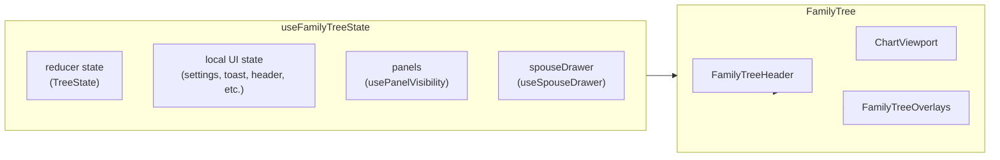

# TreeViewer v2 State

Where and how state lives in the v2 family tree: reducer state, local UI state, panel/drawer state, and how they flow through the component tree.

---

## 1. Overview

v2 state is split into (1) **reducer state** (tree navigation and view) inside `useFamilyTreeState`, (2) **local UI state** in the same hook (settings, toast, header open, etc.), and (3) **panel and drawer state** from `@/genealogy-visualization-engine` hooks (`usePanelVisibility`, `useSpouseDrawer`), which the state hook calls and returns as `panels` and `spouseDrawer`.

`useFamilyTreeState` is the single state hook consumed by FamilyTree. Pan/zoom, fetch, and build state live in other hooks (`usePanZoom`, `useDescendancyFetch`, `useTreeBuild`, `useDepth`, `useChartSearch`) and are **not** part of the state discussed here; they are called in FamilyTree and passed down as needed.

---

## 2. State flow diagram

FamilyTree calls `useFamilyTreeState(initialRootId)`, then `useFamilyTreeActions(...)` with a slice of that state. State and actions flow into FamilyTreeHeader, ChartViewport, and FamilyTreeOverlays. Pan/zoom, fetch, build, and search are separate hooks in FamilyTree and are not shown.

---

## 3. Reducer state (TreeState)

**Source:** `treeReducer` and `createInitialState("descendancy", initialRootId)` from `@/genealogy-visualization-engine`. Owned inside `useFamilyTreeState`; the hook returns `state` and `dispatch`.

**Shape (TreeState):**

| Field | Type | Description |
|-------|------|-------------|
| strategyName | string | e.g. `"descendancy"`. |
| rootId | string | Current root person id. |
| viewState | unknown | Strategy-specific view; in v2 cast to `ViewState`. |
| history | HistoryEntry[] | Navigation history entries. |
| historyIndex | number | Index of current position in history. |

**Updates:** Only via `dispatch(action)`. Actions are either core (handled by the root reducer) or strategy-specific (delegated to the descendancy reducer). See “Common actions” and “Where to find types” below.

**Initialization:** `initialRootId` from FamilyTree props is passed to `createInitialState("descendancy", initialRootId)`. Changing `initialRootId` only affects the initial state at mount; there is no in-place reset when the prop changes unless the component remounts.

---

## 4. ViewState (inside reducer state)

**What it is:** `state.viewState` cast to `ViewState` (from `@/genealogy-visualization-engine` types). Strategy-specific view data for the descendancy chart.

**Fields:**

| Field | Purpose |
|-------|--------|
| revealedUnions | Which spouse sets are expanded (person id → list of revealed spouse ids). |
| linkedUnions | Linked-union expansion state. |
| siblingView | Sibling view metadata from API (personId, spouseCatchAlls, etc.). |
| displayDepth | Depth used by builder in some cases (e.g. add one generation). |
| currentDepth | Generations shown; set by reducer (e.g. SHOW_CHILDREN); used for build and display. |
| expandDownTopRow | When set, top row of tree shows these person ids in this order (Case 2). |

**Who reads it:** useTreeBuild, useDepth, usePanToPerson, legend/panels, and the handlePersonCardAction context. It drives what is built, how deep the tree is, and how actions behave.

---

## 5. Local UI state (in useFamilyTreeState)

All of the following are React `useState` (or setters from sub-hooks) inside the state hook; none are in the reducer.

| State | Description |
|-------|--------------|
| settings | ChartSettingsV2 (showDates, showPhotos, showUnknown, autoLegendModal). Updated via `updateSetting(key, value)`. |
| toast / setToast | Current toast message or null. |
| blinkBack / triggerBlinkBack | Brief highlight effect (e.g. after “Go to person” or Home). `triggerBlinkBack()` sets true then false after 600ms. |
| headerOpen / setHeaderOpen | Header expanded or collapsed. |
| isMobile | Derived from window width (e.g. &lt; 640px); updated in the hook via a resize listener. |
| rootDisplayNames / setRootDisplayNames | Cache of root id → display name; used by useRootDisplayName. |
| goToPersonDrawerOpen / setGoToPersonDrawerOpen | Whether the Go To Person drawer is open. |

---

## 6. Panel and drawer state (external hooks)

TreeViewer does not own the implementation of these; they live in `@/genealogy-visualization-engine`. The **single instance** is created by calling the hooks inside `useFamilyTreeState`, which returns them as `panels` and `spouseDrawer`.

**usePanelVisibility** (returned as `panels`):

- Booleans: showHistoryPanel, showInfo, showSearchPanel, showDepthPanel, showSettings, showLegendModal, showLegendPanel, showDebugPanel.
- Setters for each (e.g. setShowSettings) and helpers: toggleHistoryPanel, toggleInfoPanel, closeAllMenuPanels, etc.

**useSpouseDrawer** (returned as `spouseDrawer`):

- drawerPersonId: person id whose spouse drawer is open, or null.
- openDrawer(personId), closeDrawer(), setDrawerPersonId(id | null).

---

## 7. State that is not in useFamilyTreeState

These live in other hooks called by FamilyTree and are passed to viewport, header, or overlays as needed. They are not part of “TreeViewer state” as defined in this doc.

- **Pan/zoom:** usePanZoom(svgRef, bounds, baseX, baseY) — pan, scale, pointer/wheel handlers. Passed to ChartViewport.
- **Fetch/build:** useDescendancyFetch, useTreeBuild — builder, root node, bounds, loading, descendancyDataKey. useDepth provides effectiveMaxDepth, displayedDepth, handleMaxDepthChange, etc.
- **Search:** useChartSearch — searchGivenName, searchLastName, searchResults, searchLoading, fetchNextPage, etc. Passed to header and to useFamilyTreeActions (e.g. for clearing search when closing panel).

---

## 8. How FamilyTree uses state

FamilyTree calls `useFamilyTreeState({ initialRootId })` and gets state, dispatch, viewState, settings, updateSetting, toast, setToast, blinkBack, triggerBlinkBack, headerOpen, setHeaderOpen, isMobile, rootDisplayNames, setRootDisplayNames, goToPersonDrawerOpen, setGoToPersonDrawerOpen, panels, spouseDrawer. It then calls useFamilyTreeActions with the relevant slice (dispatch, viewState, settings, panels, search, spouseDrawer, depth, setPan, etc.) and gets onAction, onDrawerSelect, rootActionDeps, setShowSearchPanel. State and actions are passed into FamilyTreeHeader, ChartViewport, and FamilyTreeOverlays; overlays also receive panel visibility, history, settings, and drawer state to render panels and drawers.

---

## 9. Derived state (outside the reducer)

- **useTreePeople(root):** Builds the list of people for the Go To Person drawer from the current root (collects nodes, maps to id/firstName/lastName, dedupes). Not stored in the reducer.
- **useRootDisplayName(rootId, effectiveRootId, rootDisplayNames, setRootDisplayNames):** Returns the display name for the current (effective) root; may update the rootDisplayNames cache as a side effect when the derived name is not yet stored.
- **Depth for UI:** Effective max depth and displayed depth come from useDepth (which depends on viewState and builder). Used by settings panel and display logic.

---

## 10. Common actions (“How do I change X?”)

| Goal | How |
|------|-----|
| Change root (e.g. from search or “Set as root”) | `dispatch({ type: "ROOT", personId })` or `dispatch({ type: "ROOT_KEEP_VIEW", personId })`. |
| Go back / forward in history | `dispatch({ type: "BACK" })` or `dispatch({ type: "FORWARD" })`. |
| Jump to history entry | `dispatch({ type: "NAVIGATE_TO_INDEX", index })`. |
| Open Settings (or other panel) | `panels.setShowSettings(true)` (or setShowInfo, setShowHistoryPanel, etc.). |
| Close a panel | e.g. `panels.setShowSettings(false)` or the panel’s onClose callback passed from FamilyTree. |
| Open spouse drawer | `spouseDrawer.setDrawerPersonId(personId)` (or openDrawer(personId)). |
| Close spouse drawer | `spouseDrawer.closeDrawer()`. |
| Reveal a spouse / toggle all spouses | `dispatch({ type: "REVEAL_SPOUSE", personId, spouseId })` or REVEAL_ALL_SPOUSES / CLOSE_ALL_SPOUSES. |
| Show children / parents / siblings | Corresponding action: SHOW_CHILDREN, PARENTS, SHOW_SIBLINGS (see genealogy-visualization-engine reducer). |
| Set tree depth | `dispatch({ type: "SET_CURRENT_DEPTH", depth })`; depth UI usually goes through handleMaxDepthChange from useDepth. |
| Open Go To Person drawer | `setGoToPersonDrawerOpen(true)`. |
| Show a toast | `setToast({ title, parts })`; clear with `setToast(null)`. |

Full action types: core actions in `reducer/types.ts` (ROOT, ROOT_KEEP_VIEW, BACK, FORWARD, NAVIGATE_TO_INDEX); descendancy actions in `reducer/strategies/descendancy/types.ts` (REVEAL_SPOUSE, CLOSE_SPOUSE, SHOW_CHILDREN, PARENTS, etc.).

---

## 11. Persistence

v2 does **not** persist TreeViewer state from this hook. Root and view are not written to the URL or localStorage by the state hook. If the app later syncs root (or other state) to the URL or storage, that would be implemented above FamilyTree (e.g. in the page or a wrapper) and is out of scope for this doc.

---

## 12. Where to find types and implementations

| What | Where |
|------|--------|
| TreeState, HistoryEntry, TreeAction, CoreAction | `@/genealogy-visualization-engine` (reducer/types.ts). |
| ViewState | `@/genealogy-visualization-engine` (types.ts). |
| DescendancyAction | `@/genealogy-visualization-engine` reducer/strategies/descendancy/types.ts. |
| useFamilyTreeState, ToastState | TreeViewer/v2/hooks/useFamilyTreeState.ts. |
| usePanelVisibility, useSpouseDrawer | `@/genealogy-visualization-engine` hooks. |
| ChartSettingsV2 | TreeViewer/v2/ChartPanels/SettingsPanel.tsx. |
